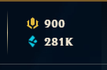
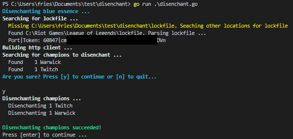

# disenchant
Disenchant all **owned** *champions* and *champion shards* with 1 click




## 🚀 Quickstart

- **Open** the LoL client
- **Download** [disenchant.exe](https://github.com/onescriptkid/disenchant/releases/download/v0.0.3/disenchant.exe)
- **Doubleclick** the exectuable - `disenchant.exe`

## 😢 Notable shortfalls

- #️⃣ only works with windows
- ~~🐧not compatible with linux~~
- ~~🍎 not compatiable with OSX~~

## Riot League Client API

`disenchant.go` queries the riot league client [api](https://riot-api-libraries.readthedocs.io/en/latest/lcu.html) to gather loot and select champion shards to convert to blue essence

### Get Request - list of champion shards
```bash
curl --insecure --basic --user riot:<password> -H "Accept: application/json" -v https://localhost:65023/lo
l-loot/v1/player-loot
```

```json
[{
	"asset":"",
	"count":1,
	"disenchantLootName":"CURRENCY_champion",
	"disenchantValue":90,
	"displayCategories":"CHAMPION",
	"expiryTime":-1,
	"isNew":false,
	"isRental":true,
	"itemDesc":"Ashe",
	"itemStatus":"OWNED",
	"localizedDescription":"",
	"localizedName":"",
	"localizedRecipeSubtitle":"",
	"localizedRecipeTitle":"",
	"lootId":"CHAMPION_RENTAL_22",
	"lootName":"CHAMPION_RENTAL_22",
	"parentItemStatus":"NONE",
	"parentStoreItemId":-1,
	"rarity":"DEFAULT",
	"redeemableStatus":"ALREADY_OWNED",
	"refId":"",
	"rentalGames":0,
	"rentalSeconds":604800,
	"shadowPath":"",
	"splashPath":"/lol-game-data/assets/v1/champion-splashes/22/22000.jpg",
	"storeItemId":22,
	"tags":"",
	"tilePath":"/lol-game-data/assets/v1/champion-tiles/22/22000.jpg",
	"type":"CHAMPION_RENTAL",
	"upgradeEssenceName":"CURRENCY_champion",
	"upgradeEssenceValue":270,
	"upgradeLootName":"CHAMPION_22",
	"value":450
}]
```

### Post Request - Disenchant **champion** or **champion shard**

```bash
# Champion Rental
curl --insecure --basic --user riot:<password> -H "Accept: application/json" -v https://localhost:65023/lol-loot/v1/recipes/CHAMPION_RENTAL_disenchant/craft?repeat=1 -d '["CHAMPION_RENTAL_22"]'

# Champion (twitch)
curl --insecure --basic --user riot:<password> -H "Accept: application/json" -v https://localhost:65023/lol-loot/v1/recipes/CHAMPION_disenchant/craft?repeat=1 -d '["CHAMPION_19"]'
```

```json
{
	"added":[
		{
			"deltaCount":90,
			"playerLoot":{
				"asset":"currency_champion",
				"count":278386,
				"disenchantLootName":"",
				"disenchantValue":0,
				"displayCategories":"",
				"expiryTime":-1,
				"isNew":true,
				"isRental":false,
				"itemDesc":"",
				"itemStatus":"NONE",
				"localizedDescription":"",
				"localizedName":"",
				"localizedRecipeSubtitle":"",
				"localizedRecipeTitle":"",
				"lootId":"CURRENCY_champion",
				"lootName":"CURRENCY_champion",
				"parentItemStatus":"NONE",
				"parentStoreItemId":-1,
				"rarity":"DEFAULT",
				"redeemableStatus":"NOT_REDEEMABLE",
				"refId":"",
				"rentalGames":-1,
				"rentalSeconds":-1,
				"shadowPath":"",
				"splashPath":"/fe/lol-loot/assets/loot_item_icons/currency_champion.png",
				"storeItemId":6,
				"tags":"",
				"tilePath":"/fe/lol-loot/assets/loot_item_icons/currency_champion.png",
				"type":"CURRENCY",
				"upgradeEssenceName":"CURRENCY_champion",
				"upgradeEssenceValue":10,
				"upgradeLootName":"",
				"value":1}}],
				"redeemed":[],
				"removed":[{"deltaCount":1,
				"playerLoot":{"asset":"",
				"count":0,
				"disenchantLootName":"CURRENCY_champion",
				"disenchantValue":90,
				"displayCategories":"CHAMPION",
				"expiryTime":-1,
				"isNew":false,
				"isRental":true,
				"itemDesc":"Ashe",
				"itemStatus":"OWNED",
				"localizedDescription":"",
				"localizedName":"",
				"localizedRecipeSubtitle":"",
				"localizedRecipeTitle":"",
				"lootId":"CHAMPION_RENTAL_22",
				"lootName":"CHAMPION_RENTAL_22",
				"parentItemStatus":"NONE",
				"parentStoreItemId":-1,
				"rarity":"DEFAULT",
				"redeemableStatus":"ALREADY_OWNED",
				"refId":"",
				"rentalGames":0,
				"rentalSeconds":604800,
				"shadowPath":"",
				"splashPath":"/lol-game-data/assets/v1/champion-splashes/22/22000.jpg",
				"storeItemId":22,
				"tags":"",
				"tilePath":"/lol-game-data/assets/v1/champion-tiles/22/22000.jpg",
				"type":"CHAMPION_RENTAL",
				"upgradeEssenceName":"CURRENCY_champion",
				"upgradeEssenceValue":270,
				"upgradeLootName":"CHAMPION_22",
				"value":450
			}
		}
	]
}
```